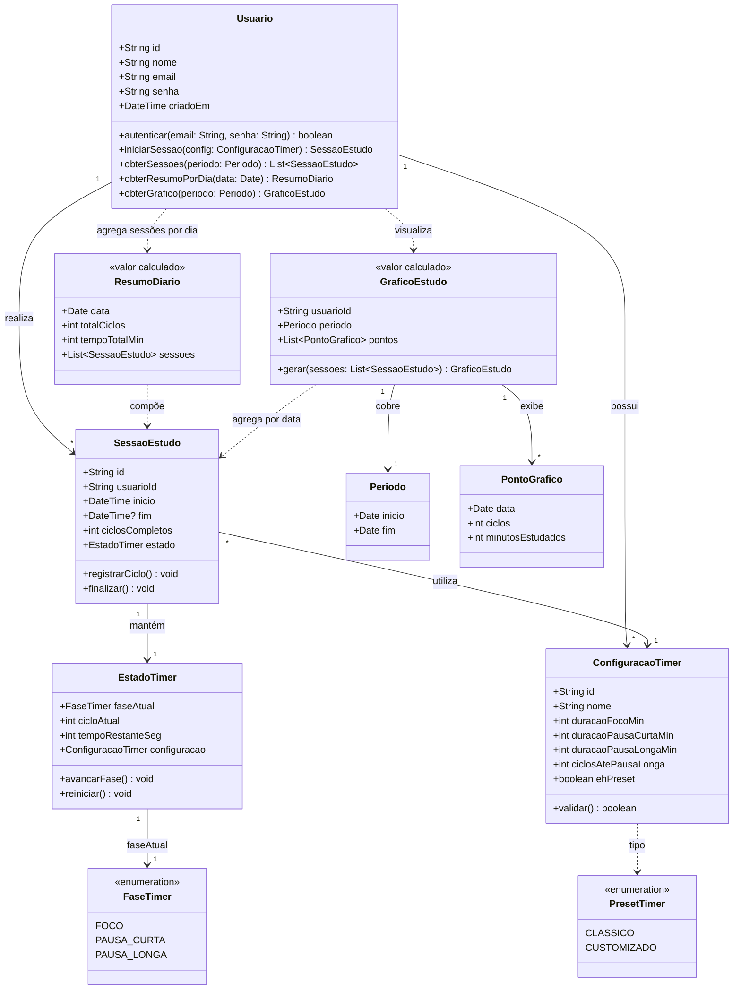

# Work & Rest

Aplicação web para gestão de tempo baseada na técnica Pomodoro, voltada principalmente ao público estudantil, mas útil a qualquer pessoa que busque produtividade em atividades que exigem concentração.

## Propósito

O sistema auxilia na gestão de tempo em relação a atividades de estudo e/ou trabalho, buscando maximizar a eficiência dessas tarefas por meio de ciclos de foco intercalados com pausas.

## Usuários

O público-alvo é majoritariamente estudantil, embora pessoas de outras áreas também possam utilizar a plataforma. Todos os usuários compartilham o mesmo perfil de funcionalidades.

## Funcionalidades

### Timer Pomodoro

- Timer automático baseado nos ciclos da técnica Pomodoro, sem necessidade de reconfiguração manual a cada ciclo.
- Presets prontos, como o **Pomodoro clássico** (4 ciclos — 25 min de foco / 5 min de pausa curta — pausa longa de 15 min).

### Personalização

- Configuração customizada de tempos de foco, pausa curta, pausa longa e quantidade de ciclos até a pausa longa.

### Dados e logs de estudo

- Cada sessão de estudo registra horário de início/término e ciclos completados.
- O resumo diário (tempo total e ciclos por dia) é **calculado** agrupando as sessões pela data de início — não é persistido como entidade separada.
- Geração de gráficos individuais a partir das sessões salvas.

## Tecnologias

| Camada        | Tecnologia                          |
|---------------|-------------------------------------|
| Front-end     | React 19 + Next.js 16 (App Router)  |
| Back-end      | API Routes / Server Actions (Next.js) |
| Linguagem     | TypeScript                          |
| Estilização   | Tailwind CSS 4                      |
| Componentes   | shadcn/ui + Base UI                 |
| Gerenciador   | pnpm                                |

---

## Documentação

### Diagrama de classes do domínio do problema

O diagrama abaixo representa as entidades centrais do domínio e seus relacionamentos, conforme descrito na proposta do projeto.

As sessões de estudo são a **fonte da verdade** dos dados. O resumo diário e os gráficos são derivados por agregação, sem entidade persistida à parte.



**Resumo das entidades:**

| Entidade             | Tipo        | Responsabilidade                                              |
|----------------------|-------------|---------------------------------------------------------------|
| `Usuario`            | Entidade    | Identifica quem usa a plataforma; credenciais (`email`, `senha`) e acesso a sessões e histórico |
| `ConfiguracaoTimer`  | Entidade    | Define durações e ciclos do Pomodoro (preset ou customizado)  |
| `SessaoEstudo`       | Entidade    | Fonte da verdade: registra início, fim e ciclos de cada sessão |
| `EstadoTimer`        | Entidade    | Controla a fase atual e o tempo restante durante a sessão     |
| `ResumoDiario`       | Calculado   | Agrupa sessões de um dia e totaliza ciclos e tempo            |
| `GraficoEstudo`      | Calculado   | Transforma sessões agrupadas por data em visualização gráfica |

---

### Ferramentas escolhidas

| Categoria        | Ferramenta              | Uso no projeto                                              |
|------------------|-------------------------|-------------------------------------------------------------|
| Versionamento    | **Git** + **GitHub**    | Controle de versão, branches e histórico de alterações      |
| Build            | **Next.js** + **pnpm**  | Compilação, bundling e scripts de desenvolvimento/produção  |
| Testes           | **Vitest** + **Testing Library** | Testes unitários e de componentes React              |
| Lint / qualidade | **ESLint**              | Análise estática e padronização de código                   |
| Issue tracking   | **Trello**       | Registro de bugs, tarefas e acompanhamento do backlog        |
| CI/CD            | **GitHub Actions**      | Pipeline automatizado de lint, testes e build               |
| Container        | **Docker**              | Empacotamento da aplicação para execução em ambientes isolados |

> **Nota:** Git, pnpm, Next.js e ESLint já estão configurados no repositório. Vitest, GitHub Actions e Docker serão adicionados conforme o projeto avançar.

---

### Frameworks reutilizados

| Framework / biblioteca | Finalidade                                              |
|------------------------|---------------------------------------------------------|
| [Next.js](https://nextjs.org/) | Framework full-stack React (rotas, SSR, API Routes) |
| [React](https://react.dev/)    | Construção da interface de usuário                    |
| [Tailwind CSS](https://tailwindcss.com/) | Estilização utilitária e responsiva         |
| [shadcn/ui](https://ui.shadcn.com/) | Componentes acessíveis e customizáveis          |
| [Base UI](https://base-ui.com/) | Primitivos de UI headless usados pelo shadcn/ui     |
| [Lucide React](https://lucide.dev/) | Ícones                                              |
| [class-variance-authority](https://cva.style/) | Variantes tipadas de classes CSS          |
| [TypeScript](https://www.typescriptlang.org/) | Tipagem estática em todo o código-fonte   |

---

### Como gerar a documentação do código

Em projetos TypeScript, o equivalente ao JavaDoc é o **[TypeDoc](https://typedoc.org/)**, que gera documentação HTML a partir de comentários **TSDoc** no código.

#### 1. Instalar o TypeDoc (dependência de desenvolvimento)

```bash
pnpm add -D typedoc
```

#### 2. Documentar funções, classes e tipos com TSDoc

```typescript
/**
 * Calcula o tempo total de estudo em minutos a partir dos ciclos completados.
 *
 * @param ciclos - Quantidade de ciclos Pomodoro finalizados
 * @param duracaoFocoMin - Duração de cada ciclo de foco, em minutos
 * @returns Tempo total estudado em minutos
 */
export function calcularTempoTotal(ciclos: number, duracaoFocoMin: number): number {
  return ciclos * duracaoFocoMin;
}
```

#### 3. Gerar a documentação

Adicione o script ao `package.json`:

```json
"docs": "typedoc --entryPoints lib --out docs/api"
```

Execute:

```bash
pnpm docs
```

A documentação gerada estará disponível em `docs/api/index.html`. Abra o arquivo no navegador para visualizar.

> **Alternativa:** a inferência de tipos do TypeScript e a documentação oficial do [Next.js](https://nextjs.org/docs) também servem como referência complementar durante o desenvolvimento.

---

### Como executar o sistema

#### Pré-requisitos

- [Node.js](https://nodejs.org/) 20 ou superior
- [pnpm](https://pnpm.io/) 9 ou superior

#### 1. Clonar o repositório

```bash
git clone <url-do-repositorio>
cd work-and-rest
```

#### 2. Instalar as dependências

```bash
pnpm install
```

#### 3. Executar em modo de desenvolvimento

```bash
pnpm dev
```

Acesse [http://localhost:3000](http://localhost:3000) no navegador.

#### 4. Outros comandos úteis

| Comando         | Descrição                              |
|-----------------|----------------------------------------|
| `pnpm build`    | Gera a build de produção               |
| `pnpm start`    | Inicia o servidor de produção          |
| `pnpm lint`     | Executa o ESLint no projeto            |

#### 5. Executar com Docker *(quando configurado)*

```bash
docker build -t work-and-rest .
docker run -p 3000:3000 work-and-rest
```

---

## Estrutura do projeto

```
work-and-rest/
├── app/                  # Rotas e páginas (App Router do Next.js)
│   ├── layout.tsx        # Layout raiz
│   ├── page.tsx          # Página inicial
│   └── globals.css       # Estilos globais
├── components/           # Componentes React reutilizáveis
│   └── ui/               # Componentes shadcn/ui
├── lib/                  # Utilitários e lógica de domínio
├── public/               # Arquivos estáticos
├── package.json
├── tsconfig.json
└── README.md
```

## Licença

Projeto acadêmico desenvolvido no contexto da disciplina de Projeto Integrado (PI).
